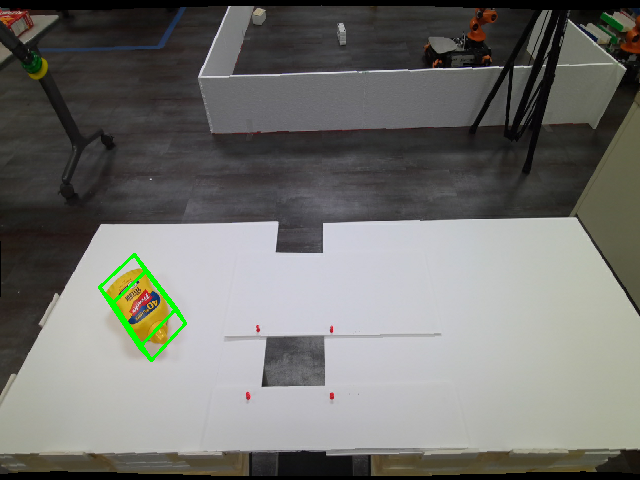

# Foundationpose-CPP
## About this project

该项目基于[nvidia-issac-pose-estimation](https://github.com/NVIDIA-ISAAC-ROS/isaac_ros_pose_estimation)改写，去除了原项目中的复杂依赖，能够使用`FoundationPose`的Python工程[FoundationPose](https://github.com/NVlabs/FoundationPose)导出的onnx模型来做推理，部署应用十分方便。

**Notes:** 该项目只包含了`FoundationPose`部分的代码，实际上6D位姿检测的运行，还依赖于目标物的掩码，需要运行类似`SAM`的算法，[EasyDeploy](https://github.com/zz990099/EasyDeploy)项目下提供了`MobileSAM`和`NanoSAM`的算法实现和推理优化，可供参考。

## Features

1. 去除了原工程的复杂环境构建过程，以及各种依赖项问题，能够轻松适配到其他项目工程中。
2. 对`FoundationPose`算法本身做了封装，简单明了。
3. 提供了基于`BundleSDF`生成目标物三维模型的[脚本教程](./docs/gen_3d_obj_with_bundlesdf.md)。

## Demo

运行公开数据`mustard`模型检测结果:

|  |
|:----------------------------------------:|
| **foundationpose(fp16) Register test result**  |

|  |
|:----------------------------------------:|
| **foundationpose(fp16) Track test result**  |

以下是在`nvidia-4060-8G`, `i5-12600kf`硬件上执行结果

|  nvidia-4060-8G   |   fps   |  cpu   |   gpu   |
|:---------:|:---------:|:----------------:|:----------------:|
|  foundationpose(fp16)-Register   |   1.5   |  100%   |  6.5GB   |
|  foundationpose(fp16)-Track   |   220   |  100%   |  5.8GB   |


## Usage

### Enviroment Build

1. 使用`docker`来构建运行环境
  ```bash
    cd ${foundationpose_cpp}/docker
    bash build_docker.sh
    bash into_docker.sh
  ```

### Convert Models

1. 从[google drive](https://drive.google.com/drive/folders/1AmBopDz-RrykSZVCroDH6jFc1-k8HkL0?usp=drive_link)中下载onnx模型文件，放到`/workspace/models/`文件夹下。

2. 运行模型转换脚本
  ```bash
    cd /workspace
    bash tools/cvt_onnx2trt.bash
  ```

### Compile Code

1. 编译整个工程
  ```bash
    cd /workspace
    mkdir build && cd build
    cmake ..
    make -j
  ```

### Run demo

#### 运行公开数据集demo ---- mustard

1. 下载数据集，放到`/workspace/test_data/`下，并解压，[下载地址](https://drive.google.com/drive/folders/1pRyFmxYXmAnpku7nGRioZaKrVJtIsroP)

2. 直接运行测试用例即可
  ```bash
    cd /workspace/build
    ./bin/simple_tests --gtest_filter=foundationpose_test.test
  ```

#### 自制三维模型

1. 参考[利用BundleSDF生成三维模型](./docs/gen_3d_obj_with_bundlesdf.md)

2. 根据您的自定义数据，修改`/workspace/simple_tests/src/test_foundationpose.cpp`下的路径，重新编译。

3. 运行测试用例
  ```bash
    cd /workspace/build
    ./bin/simple_tests --gtest_filter=foundationpose_test.test
  ```

在`/workspace/test_data/`下，可以看到`Register`和`Track`两个过程的结果。

## TODO

- [ ] 添加用户输入的管控逻辑，目前默认输入`rgb/depth/masks`的宽高为`640x480`

## References

- [nvidia-issac-pose-estimation](https://github.com/NVIDIA-ISAAC-ROS/isaac_ros_pose_estimation)
- [FoundationPose](https://github.com/NVlabs/FoundationPose)
- [BundleSDF](https://github.com/NVlabs/BundleSDF)
- [XMem](https://github.com/hkchengrex/XMem)
- [EasyDeploy](https://github.com/zz990099/EasyDeploy)

有任何问题，欢迎联系`771647586@qq.com`
